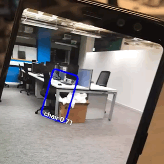
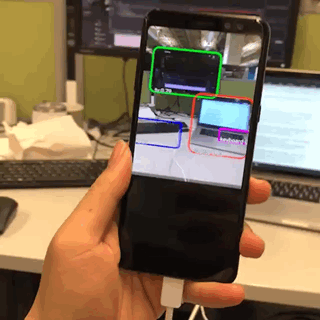

# 1. Tutorial_TFLite_android
Tutorial of how to deloy DNN on android device using TFLite.

# 2. Content
<!-- TOC -->

- [1. Tutorial_TFLite_android](#1-tutorial_tflite_android)
- [2. Content](#2-content)
- [3. Quick Start](#3-quick-start)
    - [3.1. Quick Guide](#31-quick-guide)
    - [3.2. 8-bit Quantization and Deployment on android](#32-8-bit-quantization-and-deployment-on-android)
- [4. Demo](#4-demo)
- [5. Object Detection](#5-object-detection)

<!-- /TOC -->

# 3. Quick Start
## 3.1. Quick Guide
You can follow the tutorial [here](https://www.tensorflow.org/lite/examples/). Unfortunately, only the demo of classfication works. When you run the object detection demo on your phone, it will report the runtime error "Object Detector not found". The reason is that it is lack of a shared library. This tutorial will introduce how to solve this on [this section](#object-detection).


## 3.2. 8-bit Quantization and Deployment on android
The [tutorial](https://www.tensorflow.org/lite/examples/) mentioned above only offers example models such as SSD and mobilenetv1. You can also use your own model. However, there is not a thorough and detailed tutorial which teaches you how to perform quantization and andoird deployment from online now. This toturial covers how to do this step by step.  
1. If you are using other frameworks such as MXNet or PyTorch, the first thing you need to do is convert your DNN models into tensorflow model based on [ONNX](https://onnx.ai/).
1. Before 8-bit quantization, you first need to apply fake quantization into the model using `tf.contrib.quantize.create_training_graph`  for recording min/max and `tf.contrib.quantize.create_eval_graph` for evalutaion (you can refer the [link](https://www.tensorflow.org/api_docs/python/tf/contrib/quantize/create_training_graph)). Then run it on your calibarate dataset.
1. Using [TFLite Convertor](https://www.tensorflow.org/api_docs/python/tf/lite/TFLiteConverter) to convert the fake quantized model to tflite model. Note that the operator list needs to contrain all the intermediate operators. You can do this in both command line and python code.
1. Put you quantized model on [`asset folder`](https://github.com/tensorflow/examples/tree/master/lite/examples/object_detection/android/app/src/main/assets) and revise the path in the code [here](https://github.com/tensorflow/examples/blob/34884ff54ffbba5e4466f87e1347000adabcd930/lite/examples/object_detection/android/app/src/main/java/org/tensorflow/lite/examples/detection/DetectorActivity.java#L55). Pls also make sure your label.txt in `asset folder` is corresponding to the your dataset.

# 4. Demo
The significant performance improvement can be seen when comparing these floating point with 8-bit quantization.
<table><tr align="center"><td><font size="4">Floating-point Demo</font></td><td><font size="4">8-bit demo</font></td></tr></table>

# 5. Object Detection
I have build the example project your you in `example` folder.
1. Download bazel 0.19 and tensorflow 1.13 for cross-compilation. Note that **version much be matched**, which mean if you are going to change tensorflow version, you need to change the bazel version accordingly.
1. Install Android Studio, NDK and SDK according to the guidence [here](https://github.com/tensorflow/tensorflow/tree/master/tensorflow/examples/android), then set their environment variable to their path accordingly.
1. Run `.configure` in tensorflow directory to set up android envisionment.(need to set environment variable in step 2)
1. Run the command `
bazel build -c opt --cxxopt='--std=c++11' --fat_apk_cpu=armeabi-v7a --cpu=armeabi-v7a //tensorflow/lite/examples/android:tflite_demo
`, you can change the cpu device to which you want
1. An apk will generated in `tensorflow/bazel-bin`, untar it and get the shared lib called `libtensorflow_demo.so` 
1. Create an folder called `jniLibs` and put the shared library inside there.
1. Change all the app name in all the files under the project to `org.tensorflow.demo`
1. Open the project on Android Studio, connet your android device to your computer via USB
1. Click `Sync project with gradle file`, then run. If you have apk file, you can also install via adb
```
cd /path/to/Andoird/Sdk
cd platform-tools/
./adb devices # it will list the devices number, for example aaabbbccc
./adb -s aaabbbccc install /path/to/your/apk 
```


